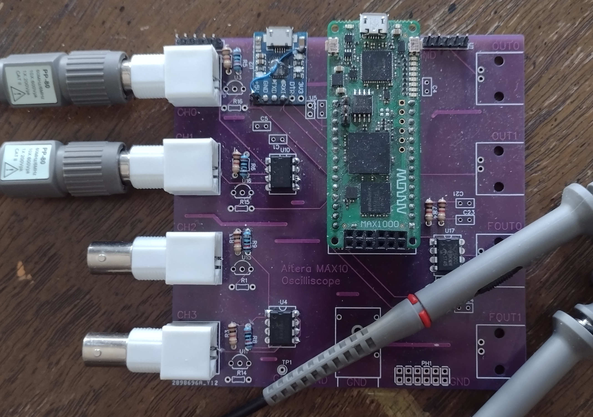
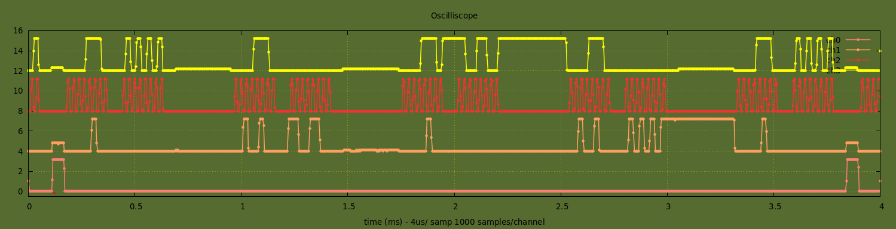
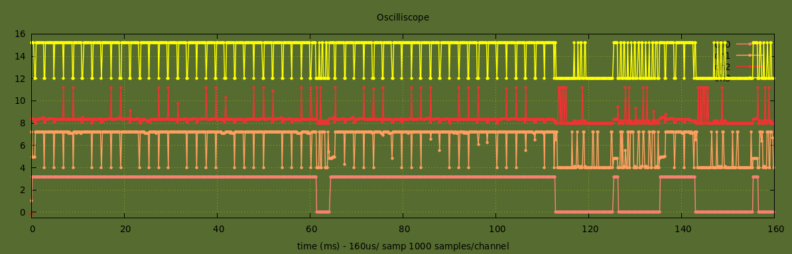
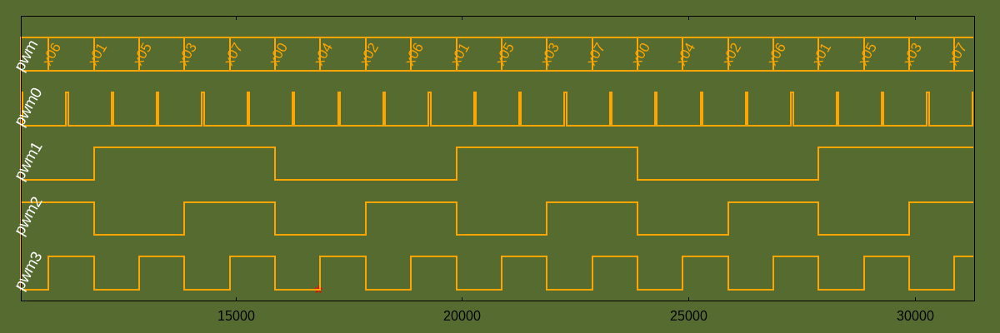

# Abstract
### A pretty good combination oscilloscope and logic analyzer is described able to sample up to 1M analog samples/second, between four channels, about 2 dozen digital signals are able to be sampled at a 200MHz sampling rate. The FPGA collects and buffers analog and digital measurements, when the user specified number of samples are reached a packet is forwarded over a serial uart over usb connection. A Laptop or Desktop computer receives this packet at 500Kbaud and converts packet to gnuplot commands which are piped to gnuplot. Gnuplot display updates up to six times per second are consistand on my 10yo machine. Both the analog and digital have a number of triggering options available. A user interface for realtime modifications of timebase, collected samples, trigger options is integrated.

# 1. Theory of Operation
#### The Oscilloscope function of the FPGA operates by generating a user programmable update_strobe, adjustable in the range 0.1sec to several minutes. This signal initiates the acquisition of ADC samples into on board buffer memory. The samples are round-robined through the active channels at a user selectable rate (powers of two times 1usec). This sequence ends when the user selected number of samples per channel times the number of channels offset by any trigger delay. When the ADC is halted the buffer has a full trace (#samples x samplerate) of valid ADC data for each active channel. At this point the output state machine is activated which generates a packet forwarded to the uart for transmission. 
#### The Logic Analyzer function is resident in the FPGA and the user can switch between the two modes at any time. The same user programmable update_strobe signal initiates the acquisition of logic samples into on board buffer memory. The samples are collected whenever any of the defined logic levels change state. This sequence ends when the user selected number of samples offset by any trigger delay. At this point the buffer has a full set of samples collected. At this point the output state machine is activated which generates a packet forwarded to the uart for transmission.
# 2. Firmware
## 2.1 Top Level Functionality
#### *logic.vhdl* provides interconnectivity for the system component pieces, adcstream.vhdl, logicstream.vhdl, testinterface.vhdl and adc_qsys.qsys. It also provides a system level memory map of user accessible registers, various system timers and strobes are setup. 
#### The top level also generates an output gated pwm output that is user selectable in cycle width and duty cycle on the pwm2 output, pwm3 has user programmed 16 bits of logic sequence and pwm4 is a user programmed synthesized sinewave.
## 2.2 Serial Interface 
#### *textinterface.vhdl* provides serial tx and rx port ttl to usb cable, baud rate is 500000 baud. The serial port is providing three functions shared on a single interface. The first of this is a high speed output path to get the oscilloscope frame packet to the computer for processing, the second is to provide an I/O interface to be able to modify parameters in the oscilloscope that effect its’ data collection, such as number of samples, time base, trigger parameters, number channel, etc. The third function is a pipe to the program gnuplot which provides the output display.
#### To view the output packet in hexadecimal connect mini usb connector to serial output port on the oscilliscope board and the other end to a lap/desktop computer, the oscilloscope board get its power from the usb cable and will power up automatically. On the computer open a terminal and check which com port the oscilloscope board is attached to. Run ‘stty -F /dev/ttyUSB0 500000 raw’, then ‘cat /dev/USB0’. You can see the raw packets being generated if everything is going right, piping this output into xxd presents the data in a readable form. The fpga comes up in oscilloscope mode two channel, no trigger mode with timing set at 1usec/sample and 1000 total samples. 
#### To peek and poke the internal fpga registers, first press switch1 on the fpga board once – this will stop the packet being transmitted on the uart serial port. Then run picocom -r -b 500000 -c. The monitor will be ready to accept commands to read and write the fpga’s internal mapped registers. There are only two commands: 1) ‘r’ followed by two hex digits – example ‘r 00’ will read register 0 and write it to monitor, 2)’w’ followed by two hex digits of address and then four digits of data – example ‘w 00 1234’ will write new register value to fpga.
#### In operation the uart serial port is connected to a program running on a lap/desktop computer that converts the packet data into a gnuplot program. The software is further described in 3. Software and 4.
# 3. Oscilloscope Data Collection and Management
#### *adcstream.vhdl* controls the collection of input voltage measurement results and generates an output packet (described in next section) to the uart serial output.
#### At a rate determined by the user, a cycle is started to acquire data from the on board analog to digital converter. A channel number is loaded into the ADC control register and an acquisition cycle started, when the ADC has completed the data is read, formated and stored into on board sram. The address of the sram in incremented, a new channel number loaded into ADC control and after a programmed delay (selecable by user – samplerate) another cycle started. The channel numbers are a round robin of the active channels. This cycle repeats until the required amount of data is stored in the buffer and the ADC halted. For the case of no trigger the ADC will be halted once the user selected number of samples are collected for each channel.
#### When a trigger is specified the ADC acquisition cycle will continue so that a full number of display samples are stored after triggering. The trigger currently implemented activates when the incoming measurements on the selected channel over the last four cycles are <50%fs, <50%fs, >=50%fs and >=50%fs (or the opposite for negative edge trigger selected), the trigger can be chosen to operate on each of the active channels positive or negative edge. Data is stored so that a full compliment of samples after the trigger are collected. The trigger offset can be greater than the number of samples (or even negative) within the constraints of the 16K sample buffer.
#### After the ADC has been halted a signal is sent to activate the output state machine. First a header is generated, then the buffer data is dumped at an offset address equal to the buffer address where the trigger occurred minus the user selectable trigger offset.
# 4. Oscilloscope Packet and Payload Format
#### The Frame Packet transmitted from the oscilloscope board to the computer has the following format.
#### Serial Packet Description   
```
|------------------|---------------|------------------------------------------------ |
| Byte Order       |       Section |   Description                                   |
|------------------|---------------|------------------------------------------------ |
|       0x00-0x07  | Header        | the string ‘oscope’                             |
|            0x08  |               | 0xTPCC00NN   T=toggle no/yes, P=pol, CC=trigch  |
|                  |               | NN=numberchannels                               |
|       0x09-0x0a  |               | numsamples                                      |
|       0x0b-0x0c  |               | samplerate        0x0001 = 1usec/sample, etc    |
|       0x0d-0x0e  |               | triggeraddress    which sample is trigger time  | 
|       0x0f-0x1b  |               | All \\\\\0xff                                   |
|       0x1c-0x1f  |               | 0x0000ffff                                      |
|------------------|---------------|-------------------------------------------------|
|       0x20-0x20+ | Data Payload  | Data payload – see structure below              |
| 2 x numsamples   |               |                                                 |
| numberchannels   |               |                                                 |
|------------------|---------------|-------------------------------------------------|
```
### Structure of Payload
```
|---|------|----------|----------|----------|----------|----------|----------|----------|
|MSB|    0 |    ch(1) |    ch(0) | data(12) | data(10) |  data(9) |  data(8) |  data(7) |
|LSB|    1 |  data(6) |  data(5) |  data(4) |  data(3) |  data(2) |  data(1) |  data(0) |
|---|------|----------|----------|----------|----------|----------|----------|----------|
```
# 5. Oscilloscope Software
#### The software sets up a connection to the oscilloscope uart output through a usb cable. As the data streams in the program synchronizes to the ‘oscope’ portion of the header and reads the rest of the header (Packet Format). The data payload portion of the packet is parsed into voltage measurements for the each of the active channels (check 2.4 Payload Format). For each packet a gnuplot command is sent to stdout, as an example – for two channels sampled 500x at 2usec as in the printout below.
```gnuplot
#!/usr/bin/gnuplot -p
set terminal wxt noraise background rgb 'dark-olivegreen'
set autoscale
set title "Oscilliscope"
set xlabel "time (ms)"
set grid ytics lt 0 lw 0.5 lc rgb "yellow"
set grid xtics lt 0 lw 0.5 lc rgb "yellow"
set yrange[-0.5:8]
set xrange[0:1.000000]
unset label 1
set label 1 "*" font ",20" at 0.100000,-.75 center tc rgb 'red'
set xlabel "time (ms) - 2us/ samp 500 samples/channel"
set style line 1 lw 1.5 pt 7 ps .5 lc rgb 'salmon'
set style line 2 lw 1.5 pt 7 ps .5 lc rgb 'sandybrown'
set style line 3 lw 1.5 pt 7 ps .5 lc rgb 'light-red'
set style line 4 lw 1.5 pt 7 ps .5 lc rgb 'yellow'
array xa[8100]
array y1a[8100]
array y2a[8100]
array y3a[8100]
array y4a[8100]
xa[8]  =  0.016;  y1a[8] =  0.000; y2a[8] =  4.000;
xa[9]  =  0.018;  y1a[9] =  0.000; y2a[9] =  4.000;
xa[10]  =  0.020;  y1a[10] =  0.000; y2a[10] =  4.000;
xa[11]  =  0.022;  y1a[11] =  0.000; y2a[11] =  4.000;
xa[12]  =  0.024;  y1a[12] =  0.000; y2a[12] =  4.000;
...
xa[498]  =  0.996;  y1a[498] =  0.000; y2a[498] =  4.000;
xa[499]  =  0.998;  y1a[499] =  0.000; y2a[499] =  4.000;
xa[500]  =  1.000;  y1a[500] =  0.000; y2a[500] =  4.000;
plot xa u 2:(y1a[$1]) title 'ch0' w linespoints ls 1, \
   xa u 2:(y2a[$1]) title 'ch1' w linespoints ls 2   
set terminal png size 1200, 400 background rgb 'dark-olivegreen'\n");
set output 'output.png'
replot
```
#### The program that was written happens to be in C. It uses stdout to output the gnuplot commands and stderr to write to the terminal. The program alternates between checking for uart rx buffer contents and  to determine if a command has been entered (further discussion in next section), if either is true the data is processed or the input command processed. Executing ‘./oscope | gnuplot’ will result in gnuplot display of the oscilloscope output, executing ‘./oscope’ command will result in the gnuplot commands being displayed on screen.
```C
//sync and read packet
int readpacket()
{
   unsigned char header[16];
   int ret, syncpat = 0;
   unsigned char syncword[8] = "1234567";
   int mask;
   unsigned char packetdata[8000];
   int num, tot;

   while(syncpat!=1){
      syncword[0] = syncword[1]; syncword[1] = syncword[2];
      syncword[2] = syncword[3]; syncword[3] = syncword[4];
      syncword[4] = syncword[5];
      read(fd, syncword + 5, 1);
      syncword[6] = 0;
      if((ret = strcmp("oscope", syncword)) == 0) syncpat = 1;
   }
   
   //chomps whole packet after syncword
   tot = 0;
   while(tot < length+11) {
      tot = tot + read(fd, packetdata + tot, length+11-tot);
   }

   //decypher rest of header
   trigger  = packetdata[0]/128;
   trig_ch  = (packetdata[0]%128)/32;
   trig_pol = (packetdata[0]%32)/16;
   chcnt    = (packetdata[0]%8);
   length   = 256 * packetdata[1] + packetdata[2];
   timeus   = 256 * packetdata[3] + packetdata[4];
   trigoff  = 256 * packetdata[5] + packetdata[6];
   
   //read payload part of packet into volt array
   vecnum = 11;   //offset from residual header
   while(vecnum < length/2){
      volt[vecnum] = 256 * packetdata[2*vecnum+1] + packetdata[2*vecnum];
      vecnum++;
   }
}
```
### The software indicates trigger sample with a red ‘\*’ on the time axis, in the case of triggers outside of the plot arrows are shown pointing in the direction of the trigger point. The trigger is offset from the start of trace by a user defined trigger offset.

# 6. Oscilloscope Demonstration
#### To start the program enter ./oscope0 | gnuplot, as the screen shot embedded shows. For a full list of commands available type h, a list of commands shows on the screen. Most of these commands do not need much explaination, y toogles adding 4 volt offsets to each channel, u changes oscope display update rate. A example is shown of changing the timebase. Once the request timebase is entered the contents of the affected fpfa mapped resgisters are displayed, a status line appears summarizing the acquisition state.
```
timebase <time in us>
samples <number samples>
channels <number channeles>
trigoff <fraction of full scale (can be +/-)>
trigchan <trigger channel>
trigger <trigger> <polarity>
x - timebase
y - channel volt offsets toggle - seperate by 4v
c - number of channels
S - number of samples
t - toggle trigger off/+edge/-edge
C - toggle trigger channel
p - pwm rate and percent
u - update rate
o - trigger offset in samples
i - sync fpga to gnuplot
h - this message
```
#### As an example of a use use case for the oscillicope, a cp2102 usb to ttl uart serial adapter was hooked up to a computer and assigned /dev/ttyUSB1. The port was configured by ‘stty -F /dev/ttyUSB1 115200. The oscilloscope at /dev/ttyUSB0 was connected by running ‘./oscope0 | gnuplot’. The following parameters were changes, samples (S) to 2000, channels (c) to 1, timebase to 2 and o (trigger offset to .15). Attach channel1 scope lead to rx pin of the cp2101 module.
#### In an idle terminal window type ‘echo hi > devttyUSB1’, a display similar to the one about should appear on your monitor. It shows a display of one channel, sampled at 1usec rate for 2msec. The trace shows three ascii characters which decode as 0x68, 0x69 and 0x0a, or ‘hi\<lf\>’ along with start and stop bits at 115200 baud. (The digital sequence was photoshopped in to demonstrate the ascii output. 
#### The next couple trace displays come from a project integrating some NRL24L0+ 2.4GHz R/F modules. These devices use an spi communications protocol. The first graph shows, from the bottom trace


#### chip enable, miso, spi clk and mosi. This trace is showing several bytes of data read and written to the module. The next trace displays shows the nrf24l0+ waiting for a packet and timing out, then waiting for a packet till received, then reading the packet and responding.
#### Having the scope really helped in the debug of this interference. 
# 7. Logic Analyzer Data Collection and Management
#### *adcstream.vhdl* controls the collection of input voltage measurement results and generates an output packet (described in next section) to the uart serial output.
#### At a rate determined by the user, a cycle is started to acquire data from the on board analog to digital converter. A channel number is loaded into the ADC control register and an acquisition cycle started, when the ADC has completed the data is read, formated and stored into on board sram. The address of the sram in incremented, a new channel number loaded into ADC control and after a programmed delay (selecable by user – samplerate) another cycle started. The channel numbers are a round robin of the active channels. This cycle repeats until the required amount of data is stored in the buffer and the ADC halted. For the case of no trigger the ADC will be halted once the user selected number of samples are collected for each channel.
#### When a trigger is specified the ADC acquisition cycle will continue so that a full number of display samples are stored after triggering. The trigger currently implemented activates when the incoming measurements on the selected channel over the last four cycles are <50%fs, <50%fs, >=50%fs and >=50%fs (or the opposite for negative edge trigger selected), the trigger can be chosen to operate on each of the active channels positive or negative edge. Data is stored so that a full compliment of samples after the trigger are collected. The trigger offset can be greater than the number of samples (or even negative) within the constraints of the 16K sample buffer.
#### After the ADC has been halted a signal is sent to activate the output state machine. First a header is generated, then the buffer data is dumped at an offset address equal to the buffer address where the trigger occurred minus the user selectable trigger offset.
# 8. Logic Analyzer Packet and Payload Format
#### The Frame Packet transmitted from the oscilloscope board to the computer has the following format.
#### Logic Analyzer Serial Packet Description   
```
|------------------|---------------|------------------------------------------------ |
| Byte Order       |       Section |   Description                                   |
|------------------|---------------|------------------------------------------------ |
|       0x00-0x08  | Header        | the string ‘logical’                            |
|       0x09-0x0a  |               | numsamples                                      |
|       0x0b-0x0c  |               | samplerate        0x0001 = 1usec/sample, etc    |
|       0x0d-0x0e  |               | triggeraddress    which sample is trigger time  | 
|       0x0f-0x1b  |               | All \\\\\0xff                                   |
|       0x1c-0x1f  |               | 0x0000ffff                                      |
|------------------|---------------|-------------------------------------------------|
|     0x20-0x20+   | Data Payload  | Data payload – see structure below              |
|      numsamples  |               |                                                 |
|------------------|---------------|-------------------------------------------------|
```
#### Structure of Logic Analyzer Payload
```
|byte7|    byte6   |    byte5   |    byte4   |     byte3  |     byte2  |     byte1  |     byte0  |    
|-----|------------|------------|------------|------------|------------|------------|------------|
|   1 |   time(27) |   time(26) |   time(25) |   time(24) |   time(23) |   time(22) |   time(21) |
|   0 |   time(20) |   time(19) |   time(18) |   time(17) |   time(16) |   time(15) |   time(14) |
|   0 |   time(13) |   time(12) |   time(11) |   time(10) |    time(9) |    time(8) |    time(7) |
|   0 |    time(6) |    time(5) |    time(4) |    time(3) |    time(2) |    time(1) |    time(0) |
|   0 | vector(27) | vector(26) | vector(25) | vector(24) | vector(23) | vector(22) | vector(21) |
|   0 | vector(20) | vector(19) | vector(18) | vector(17) | vector(17) | vector(16) | vector(15) |
|   0 | vector(13) | vector(12) | vector(11) | vector(10) |  vector(9) |  vector(8) |  vector(7) |
|   0 |  vector(6) |  vector(5) |  vector(4) |  vector(3) |  vector(2) |  vector(1) |  vector(0) |
|-----|------------|------------|------------|------------|------------|------------|------------|
```
# 9. Logic Analyzer Software 
#### The software sets up a connection to the oscilloscope uart output through a usb cable. As the data streams in the program synchronizes to the ‘oscope’ portion of the header and reads the rest of the header (check 2.4 Packet Format). The data payload portion of the packet is parsed into voltage measurements for the each of the active channels (check 2.4 Payload Format). For each packet a gnuplot command is sent to stdout, as an example – for two channels sampled at 2usec:

#### The program that was written happens to be in C. It uses stdout to output the gnuplot commands and stderr to write to the terminal. The program alternates between checking for uart rx buffer contents and invoking kbhit() to determine if a command has been entered (further discussion in next section), if either is true the data is processed or the input command processed. Executing ‘./oscope | gnuplot’ will result in gnuplot display of the oscilloscope output, executing ‘./oscope’ command will result in the gnuplot commands being displayed on screen.
#### The software indicates trigger sample with a red ‘\*’ on the time axis, in the case of triggers outside of the plot arrows are shown pointing in the direction of the trigger point. The trigger is offset from the start of trace by a user defined trigger offset.
```C
int main(int argc, char **argv) {IMG_20220322_100712587
   char buff[64];
   int aa =0, a;
   time_t oldMTime, newMTime;
   struct stat file_stat;
   struct timeval timeout;
   timeout.tv_sec = 0; timeout.tv_usec = 0;
   fd_set rfds;
   FD_ZERO(&rfds);

   //setup serial port
   if(argc == 1) fd = serial_open("/dev/ttyUSB0", B500000);
   if(argc == 2) {sscanf(argv[1], "%s", buff); fd = serial_open(buff, B500000); }
   if (fd < 0) {fprintf(stderr, "cant find port %s\n", buff); exit(0); }

   while(1) {
      //check if timestamp on ./definitions has changed
      stat("./definitions", &file_stat);
      newMTime = file_stat.st_mtime;
      if (newMTime > oldMTime) { oldMTime = newMTime; rerundef(); }

      aa=0; FD_SET(STDIN_FILENO, &rfds);      //read stdin from terminal if present
      if (select(1, &rfds, NULL, NULL, &timeout)) {
         while(1){ read(STDIN_FILENO, buff + aa++, 1); if(buff[aa-1] == '\n') break; }
         if(sscanf(buff, "trigoff %d", &offset)==1) {buff[0]='i';} else
         if(sscanf(buff, "samples %d", &samples)==1) {buff[0]='i';}
         menu(buff[0]);
      }
      readpacket();                           //read packet
      mkgnuplotprog();                        //make gnuplot program
   }
}
```
```perl
#definition file for logic.c analyzer
#leading sharp is comment
#column 1 is name you want on plot
#column 2 is lsb of  packet data to plot
#column 3 is width of vector assigned to name
#column 4 is trigger value 
#   - neg value will not contribute to trigger
#   - each >= 0 value will contribute to trig word
#   - trig generated on first occurance of trig word


#str1u     13   1    -1
#cnt1u      4   8    45
pwm3        3   1    -1
pwm2        2   1    -1
pwm1        1   1    -1
pwm0        0   1    -1
pwm         1   3     4

```
# 10. Logic Analyzer Demonstration
#### To start the program enter ./oscope0 | gnuplot, as the screen shot embedded shows. For a full list of commands available type h, a list of commands shows on the screen. Most of these commands do not need much explaination, y toogles adding 4 volt offsets to each channel, u changes oscope display update rate. A example is shown of changing the timebase. Once the request timebase is entered the contents of the affected fpfa mapped resgisters are displayed, a status line appears summarizing the acquisition state. 

#### As an example of a use use case for the oscillicope, a cp2102 usb to ttl uart serial adapter was hooked up to a computer and assigned /dev/ttyUSB1. The port was configured by ‘stty -F /dev/ttyUSB1 115200. The oscilloscope at /dev/ttyUSB0 was connected by running ‘./oscope0 | gnuplot’. The following parameters were changes, samples (S) to 2000, channels (c) to 1, timebase to 2 and o (trigger offset to .15). Attach channel1 scope lead to rx pin of the cp2101 module.
#### In an idle terminal window type ‘echo hi > devttyUSB1’, a display similar to the one about should appear on your monitor. It shows a display of one channel, sampled at 1usec rate for 2msec. The trace shows three ascii characters which decode as 0x68, 0x69 and 0x0a, or ‘hi\<lf\>’ along with start and stop bits at 115200 baud. (The digital sequence was photoshopped in to demonstrate the ascii output. 
#### The next couple trace displays come from a project integrating some NRL24L0+ 2.4GHz R/F modules. These devices use an spi communications protocol. The first graph shows, from the bottom trace
#### chip enable, miso, spi clk and mosi. This trace is showing several bytes of data read and written to the module. The next trace displays shows the nrf24l0+ waiting for a packet and timing out, then waiting for a packet till received, then reading the packet and responding.
# 11. Setting up Software
## 11.1 Altera Quartus
#### Search and download Intel Quartus Prime Lite Edition Design Software, my machine is running ubuntu and using version 21.1. Extract software and install.sh. Give your self permissions for a serial port if necessary.
#### From a terminal go to directory where you want cyc1000-drone project installed and install git. The git project contains just those files necessary to be able to compile the firmware to generate both sram and prom fpga images. To download project directory enter the following command. 
```
git clone -r https://github.com/baetis-ma/max1000-oscope.git
As a short cut to get the quartus gui running -
~/intelFPGA_lite/21.1/quartus/bin/quartus --64bit top.qpf 
```
#### Starting a project and getting things going with the gui has its uses, but it is also possible to edit files and program the device directly with your own IDE with a few simple commands.
 ```
 ~/intelFPGA_lite/21.1/nios2eds/nios2_command_shell.sh                                (set environment)
quartus_sh --flow compile oscope                                                      (compiles project)
quartus_pgm -m jtag -o "p;/home/mark/Desktop/max1000-oscope/output_files/oscope.sof"  (program fpga sram)
quartus_pgm -m jtag -o "p;/home/mark/Desktop/max1000-oscope/output_files/oscope.pof"  (program fpga eprom)
```
#### The file command in the base directory has several other useful commands.
## 11.2 Compiling oscope and logic programs
#### Permissions

