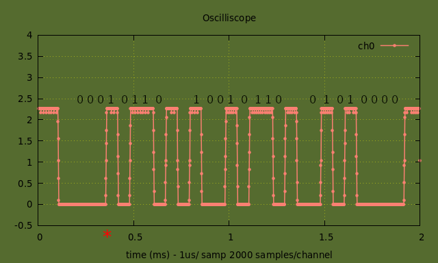

# Abstract
##### A pretty good combination oscilloscope and logic analyzer is described able to sample up to 1M analog samples/second shared between up to four channels, and about 2 dozen digital signals sampled digitally at a 200MHz. The FPGA collects and buffers the analog and digital measurements, when the user specified number of samples are reached a packet is forwarded over a serial uart over usb connection. A Laptop or Desktop computer receives this packet at 500Kbaud and converts packet to a gnuplot program which is piped to gnuplot. Gnuplot display updates up to six times per second are consistent on my 10yo machine. Both the analog and digital have a number of triggering options available. A user interface for realtime modifications of timebase, collected samples, trigger options is integrated. 


## 1. Theory of Operation
##### The Oscilloscope function of the FPGA operates by generating a user programmable update_strobe, adjustable in the range 0.1sec to several minutes, this signal initiates the acquisition of ADC samples into on board buffer memory. The samples are round-robined through the active channels at a user selectable rate (multiples of 1usec). This sequence ends when the user selected number of samples per channel times the number of channels offset by any trigger delay is reached and the ADC is halted. Ihe buffer at this point has a full trace (#samples x samplerate) of valid ADC data for each active channel, the output state machine is activated which generates a packet forwarded to the uart for transmission. 
##### The Logic Analyzer function is resident in the FPGA and the user can switch between the two modes. The same user programmable update_strobe signal initiates the acquisition of logic samples into on board buffer memory. The samples are collected whenever any of the defined logic levels change state. This sequence ends when the user selected number of samples offset by any trigger offset. At this point the buffer has a full set of samples collected, the output state machine is activated which generates a packet forwarded to the uart for transmission.
## 2. Oscilloscope Firmware
### 2.1 Top Level Functionality
##### *logic.vhdl* provides interconnectivity for the system component pieces, adcstream.vhdl, logicstream.vhdl, testinterface.vhdl and adc_qsys.qsys. It also provides a system level memory map of user accessible registers, various system timers and strobes are setup.
### 2.2 Serial Interface 
##### *textinterface.vhdl* provides serial tx and rx port ttl to usb cable, baud rate is 500000 baud. The serial port is providing two functions shared on a single interface. The first of this is a high speed output path to get the oscilloscope frame packet to the computer for processing, the second is to provide an I/O interface to be able to modify parameters in the oscilloscope that effect its’ data collection, such as number of samples, time base, trigger parameters, number channel, etc.
##### To view the raw output packet connect mini usb connector to serial output port on the oscilloscope board and the other end to a lap/desktop computer, the oscilloscope board get its power from the usb cable and will power up automatically. On the computer open a terminal and check which com port the oscilloscope board is attached to. Run `stty -F /dev/ttyUSB0 500000 raw`, then try the following commands. 
```
--> cat /dev/ttyUSB0 
oscope��E����������������%��%��%��%��%��%��%��%��%��%��%��%��%��%��%��%��%��%��%��%��%��%��%��%��%��%��%��%��%��%��%��%��%��%��%��%��%��%��%��%��%��%��%��%��%��%��%��%��&�       �&��&��&��&��&��&��&��&��&��&��&��&��&��&��&��&��&��&��&��&��%��%��%��%��%��%��%��%��%��%��%��%��%��%��%��%��%��%��%��%��%��%��%�&��&��&��&��&��&��&��&��&��&��&��&��&��&��&��&��&��&��&��&��&��&��&��&��&��&��&��&��&��&��&��&��&��&��&��&��&��&��&��&��&��&��&��&��&��&��
```
##### You can see the raw packets being generated if everything is going right, piping this output into xxd presents the data in a readable form. The fpga comes up in oscilloscope mode two channel, no trigger mode with timing set at 1usec/sample and 1000 total samples.
```
--> cat /dev/ttyUSB0 | xxd
00000000: 0a0d 6f73 636f 7065 9207 d000 0100 f9ff  ..oscope........
00000010: ffff ffff ffff ffff ffff ffff 0000 ffff  ................
00000020: b823 8800 b723 8900 b723 8800 b723 8800  .#...#...#...#..
00000030: b723 8800 b723 8800 b723 8800 b823 8800  .#...#...#...#..
00000040: b723 8800 b823 8800 b723 8800 b623 8800  .#...#...#...#..
00000050: b623 8800 b623 8700 b723 8800 b623 8800  .#...#...#...#..
00000060: b723 8800 b723 8800 b723 8800 b623 8800  .#...#...#...#..
... skipping several lines
00000780: bc23 8800 bb23 8800 bb23 8800 bb23 8800  .#...#...#...#..
00000790: bc23 8800 bb23 8900 bc23 8900 bc23 8800  .#...#...#...#..
000007a0: bb23 8900 bc23 8800 bc23 8800 bc23 8800  .#...#...#...#..
000007b0: bb23 8800 bc23 8800 bc23 8800 bb23 8700  .#...#...#...#..
000007c0: bc23 8800 bc23 8800 bb23 8800 bc23 8800  .#...#...#...#..
000007d0: bc23 8800 bc23 8800 bc23 8800 bc23 8800  .#...#...#...#..
000007e0: bc23 8800 bd23 8800 bc23 8800 bb23 8800  .#...#...#...#..
000007f0: bb0a 0d0a 0d6f 7363 6f70 6592 07d0 0001  .....oscope.....
00000800: 00c5 ffff ffff ffff ffff ffff ffff ff00  ................
00000810: 00ff ffd0 2488 00d0 2488 00cf 2488 00d0  ....$...$...$...
```
##### To peek and poke the internal fpga registers, first press switch1 on the fpga board once – this will stop the packet being transmitted on the uart serial port. Then run `picocom -r -b 500000 -c`. The monitor will be ready to accept commands to read and write the fpga’s internal mapped registers. There are only two commands: 1) ‘r’ followed by two hex digits – example `r 00` will read register 0x00 and write it to monitor, 2)’w’ followed by two hex digits of address and then four digits of data – example `w 00 1234` will write 0x1234 into address 0x10 of the fpga register space.
##### In operation the uart serial port is connected to a program running on a lap/desktop computer that converts the packet data into a gnuplot program. The software is further described below. 
### 2.3 Oscilloscope Data Collection and Management
##### *adcstream.vhdl* controls the collection of input voltage measurement results and generates an output packet (described in next section) to the uart serial output.
##### At a rate determined by the user, a cycle is started to acquire data from the on board analog to digital converter. A channel number is loaded into the ADC control register and an acquisition cycle started, when the ADC has completed the data is read, formatted and stored into on board sram. The address of the sram in incremented, a new channel number loaded into ADC control and after a programmed delay (selecable by user – samplerate) another cycle started. The channel numbers are a round robin of the active channels. This cycle repeats until the required amount of data is stored in the buffer and the ADC halted. For the case of no trigger the ADC will be halted once the user selected number of samples are collected for each channel.
##### When a trigger is specified the ADC acquisition cycle will continue so that a full number of display samples are stored after triggering. The trigger currently implemented activates when the incoming measurements on the selected channel over the last four cycles are <50%fs, <50%fs, >=50%fs and >=50%fs (or the opposite for negative edge trigger selected), the trigger can be chosen to operate on each of the active channels positive or negative edge. Data is stored so that a full compliment of samples after the trigger are collected. The trigger offset can be greater than the number of samples (or even negative) within the constraints of the 8K sample buffer.
##### After the ADC has been halted a signal is sent to activate the output state machine. First a header is generated, then the buffer data is dumped at an offset address equal to the buffer address where the trigger occurred minus the user selectable trigger offset.
### 2.4 Oscilloscope Packet and Payload Format
#### Serial Packet Description   
```
|------------------|---------------|------------------------------------------------ |
| Byte Order       |       Section |   Description                                   |
|------------------|---------------|------------------------------------------------ |
|       0x00-0x07  | Header        | the string ‘oscope’                             |
|            0x08  |               | 0xTPCC00NN   T=toggle no/yes, P=pol, CC=trigch  |
|                  |               | NN=numberchannels                               |
|       0x09-0x0a  |               | numsamples                                      |
|       0x0b-0x0c  |               | samplerate        0x0001 = 1usec/sample, etc    |
|       0x0d-0x0e  |               | triggeraddress    which sample is trigger time  | 
|       0x0f-0x1b  |               | All \\\\\0xff                                   |
|       0x1c-0x1f  |               | 0x0000ffff                                      |
|------------------|---------------|-------------------------------------------------|
|       0x20-0x20+ | Data Payload  | Data payload – see structure below              |
| 2 x numsamples   |               |                                                 |
| numberchannels   |               |                                                 |
|------------------|---------------|-------------------------------------------------|
```
#### Structure of Payload
```
|---|-------|----------|----------|----------|----------|----------|----------|----------|
|   | byte7 |   byte6  |   byte5  |   byte4  |   byte3  |   byte2  |   byte1  |   byte0  |
|---|-------|----------|----------|----------|----------|----------|----------|----------|
|MSB|    0  |    ch(1) |    ch(0) | data(12) | data(10) |  data(9) |  data(8) |  data(7) |
|LSB|    1  |  data(6) |  data(5) |  data(4) |  data(3) |  data(2) |  data(1) |  data(0) |
|---|-------|----------|----------|----------|----------|----------|----------|----------|
```
## 3. Oscilloscope Software
##### The software sets up a connection to the oscilloscope uart output through a usb cable. As the data streams in the program synchronizes to the ‘oscope’ portion of the header and reads the rest of the header. The data payload portion of the packet is parsed into voltage measurements for the each of the active channels. For each packet a gnuplot command is sent to stdout, as an example – for two channels sampled 500x at 2usec as in the printout below.
```gnuplot
#!/usr/bin/gnuplot -p
set terminal wxt noraise background rgb 'dark-olivegreen'
set autoscale
set title "Oscilliscope"
set xlabel "time (ms)"
set grid ytics lt 0 lw 0.5 lc rgb "yellow"
set grid xtics lt 0 lw 0.5 lc rgb "yellow"
set yrange[-0.5:8]
set xrange[0:1.000000]
unset label 1
set label 1 "*" font ",20" at 0.100000,-.75 center tc rgb 'red'
set xlabel "time (ms) - 2us/ samp 500 samples/channel"
set style line 1 lw 1.5 pt 7 ps .5 lc rgb 'salmon'
set style line 2 lw 1.5 pt 7 ps .5 lc rgb 'sandybrown'
set style line 3 lw 1.5 pt 7 ps .5 lc rgb 'light-red'
set style line 4 lw 1.5 pt 7 ps .5 lc rgb 'yellow'
array xa[8100]
array y1a[8100]
array y2a[8100]
array y3a[8100]
array y4a[8100]
xa[8]  =  0.016;  y1a[8] =  0.000; y2a[8] =  4.000;
xa[9]  =  0.018;  y1a[9] =  0.000; y2a[9] =  4.000;
xa[10]  =  0.020;  y1a[10] =  0.000; y2a[10] =  4.000;
xa[11]  =  0.022;  y1a[11] =  0.000; y2a[11] =  4.000;
xa[12]  =  0.024;  y1a[12] =  0.000; y2a[12] =  4.000;
... skipping several hundred lines ...
xa[498]  =  0.996;  y1a[498] =  0.000; y2a[498] =  4.000;
xa[499]  =  0.998;  y1a[499] =  0.000; y2a[499] =  4.000;
xa[500]  =  1.000;  y1a[500] =  0.000; y2a[500] =  4.000;
plot xa u 2:(y1a[$1]) title 'ch0' w linespoints ls 1, \
   xa u 2:(y2a[$1]) title 'ch1' w linespoints ls 2   
set terminal png size 1200, 400 background rgb 'dark-olivegreen'\n");
set output 'output.png'
replot
```
##### The program that was written happens to be in C. It uses stdout to output the gnuplot commands and stderr to write to the terminal. The program alternates between checking for uart rx buffer contents and determining if a command has been entered, if either is true the data is processed or the input command processed. Executing `./oscope | gnuplot` will result in gnuplot display of the oscilloscope output, executing `./oscope` command will result in the gnuplot commands being displayed on the terminal.
##### The read packet subroutine is shown below, once called the program sits in a loop reading bytes from the serial port until the last six characters received are 'oscope'. The rest of the packet is read in as a chunk and sorted out into the rest of the contents of the header and then the payload moved into the volt array.
```C
//sync and read packet
int readpacket()
{
   unsigned char header[16];
   int ret, syncpat = 0;
   unsigned char syncword[8] = "1234567";
   int mask;
   unsigned char packetdata[8000];
   int num, tot;

   while(syncpat!=1){
      syncword[0] = syncword[1]; syncword[1] = syncword[2];
      syncword[2] = syncword[3]; syncword[3] = syncword[4];
      syncword[4] = syncword[5];
      read(fd, syncword + 5, 1);
      syncword[6] = 0;
      if((ret = strcmp("oscope", syncword)) == 0) syncpat = 1;
   }
   
   //chomps rest of header after syncword
   tot = 0;
   while(tot < 24) {
      tot = tot + read(fd, packetdata + tot, length+11-tot);
   }

   //decypher rest of header
   trigger  = packetdata[0]/128;
   trig_ch  = (packetdata[0]%128)/32;
   trig_pol = (packetdata[0]%32)/16;
   chcnt    = (packetdata[0]%8);
   length   = 256 * packetdata[1] + packetdata[2];
   timeus   = 256 * packetdata[3] + packetdata[4];
   trigoff  = 256 * packetdata[5] + packetdata[6];
   
   //chomps rest of packet - data payload
   tot = 0;
   while(tot < length) {
      tot = tot + read(fd, packetdata + tot, length-tot);
   }
   
   //read payload part of packet into volt array
   vecnum = 0;
   while(vecnum < length/2){
      volt[vecnum] = 256 * packetdata[2*vecnum+1] + packetdata[2*vecnum];
      vecnum++;
   }
}
```
##### The mkgnuplotprg() subroutine take the contents of the volt array and assembles the gnuplot commands to program the oscilloscope display. The software indicates trigger sample with a red ‘\*’ on the time axis, in the case of triggers outside of the plot arrows are shown pointing in the direction of the trigger point. The trigger is offset from the start of trace by a user defined trigger offset.
## 4. Oscilloscope Demonstration
##### To start the program enter `./oscope0 | gnuplot`. For a full list of commands available type h, a list of commands shows on the screen below. Most of these commands do not need much explanation, y toggles adding 4 volt offsets to each channel, u changes oscope display update rate. Commands can be entered as a command string, if the command string is recognized and the parameters valid the command will be applied. If the command was not recognized the first char of the string will be examined as the menu shows, in which case the user will be prompted for input.
```
--> ./oscope | gnuplot
help                                 (typed by user or just h)
timebase <time in us>
samples <number samples>
channels <number channeles>
trigoff <fraction of full scale (can be +/-)>
trigchan <trigger channel>
trigger <trigger> <polarity>
x - timebase
y - channel volt offsets toggle - seperate by 4v
c - number of channels
S - number of samples
t - toggle trigger off/+edge/-edge
C - toggle trigger channel
p - pwm rate and percent
u - update rate
o - trigger offset in samples
i - sync fpga to gnuplot
h - this message
```
##### As an example of an use case for the oscilloscope, a cp2102 usb to ttl uart serial adapter was hooked up to a computer and assigned /dev/ttyUSB1. The port was configured with ‘stty -F /dev/ttyUSB1 115200. The oscilloscope at /dev/ttyUSB0 was run `./oscope0 | gnuplot`. The following parameters were changed, samples (S) to 2000, channels (c) to 1, timebase to 2msec and o (trigger offset) to .15(%). Attach channel1 scope lead to rx pin of the cp2101 module. In an idle terminal window type `echo hi > devttyUSB1`, a display similar to the one about should appear on your monitor. It shows a display of one channel, sampled at 1usec rate for 2msec. The trace shows three ascii characters which decode as 0x68, 0x69 and 0x0a, or ‘\<lf\>’ along with start and stop bits at 115200 baud. (The digital sequence was photo shopped in to demonstrate the ascii output - this was my first trace when debugging the oscilloscope). 

##### The next couple trace displays come from a project integrating some NRL24L0+ 2.4GHz R/F modules. These devices use an spi communications protocol. The first graph shows, from the bottom trace chip enable, miso, spi clk and mosi. This trace is showing several bytes of data read and written to the module. The next trace displays shows the nrf24l0+ waiting for a packet and timing out, then waiting for a packet till received, then reading the packet and responding.


 
## 5. Logic Analyzer Firmware
### 5.1 Logic Analyzer Data Collection and Management
##### *adcstream.vhdl* controls the collection of input state results and generates an output packet to the uart serial output.
##### At an update rate determined by the user, a cycle is started to acquire data from the on board digital signals. If any of the umasked signals change state 27 bits of data are stored in sram along with a timestamp (number of clocks since acq start). The address of the sram in incremented and another cycle started, this cycle repeats until the required amount of data is stored in the buffer and acquisition halted.
##### There are three user set 32 bit vectors that are used to sample and trigger the collection data. The data bits availble to the logic analyzer are placed in the logic_vector word defined in logic.vhdl. logic_mask determins which of the signals in logic_vector are examined for change of state, if the state has changed compared to the last sampling clock then logic_vector is stored in onboard sram. The trigger operates according to the condition that:
```vhdl
    if (triggered = '0' and                             --not triggered yet this cycle
       logic_write_addr > trigger_offset and            --greater than trigger offset
       (logic_data and logic_trig0) = logic_trig1) then --mask data equal to trigger value
           triggered <= '1';
           triggered_addr <= logic_write_addr + '1';
    end if;
```
##### Notice that the data stored in the buffer is for each sample of data, the time of this event is also stored in the buffer. The user specifies a number of samples to stroe and display, the draphing tool converts this to x axis time for the display.
##### After the acqisition has been halted a signal is sent to activate the output state machine. First a header is generated, then the buffer data is dumped at an offset address equal to the buffer address where the trigger occurred minus the user selectable trigger offset.
### 5.2 Logic Analyzer Packet and Payload Format
#### Logic Analyzer Serial Packet Description   
```
|------------------|---------------|------------------------------------------------ |
| Byte Order       |       Section |   Description                                   |
|------------------|---------------|------------------------------------------------ |
|       0x00-0x08  | Header        | the string ‘logical’                            |
|       0x09-0x0a  |               | numsamples                                      |
|       0x0b-0x0c  |               | samplerate        0x0001 = 1usec/sample, etc    |
|       0x0d-0x0e  |               | triggeraddress    which sample is trigger time  | 
|       0x0f-0x1b  |               | All \\\\\0xff                                   |
|       0x1c-0x1f  |               | 0x0000ffff                                      |
|------------------|---------------|-------------------------------------------------|
|     0x20-0x20+   | Data Payload  | Data payload – see structure below              |
|      numsamples  |               |                                                 |
|------------------|---------------|-------------------------------------------------|
```
#### Structure of Logic Analyzer Payload
```
|-----|------------|------------|------------|------------|------------|------------|------------|
|byte7|    byte6   |    byte5   |    byte4   |     byte3  |     byte2  |     byte1  |     byte0  |    
|-----|------------|------------|------------|------------|------------|------------|------------|
|   1 |   time(27) |   time(26) |   time(25) |   time(24) |   time(23) |   time(22) |   time(21) |
|   0 |   time(20) |   time(19) |   time(18) |   time(17) |   time(16) |   time(15) |   time(14) |
|   0 |   time(13) |   time(12) |   time(11) |   time(10) |    time(9) |    time(8) |    time(7) |
|   0 |    time(6) |    time(5) |    time(4) |    time(3) |    time(2) |    time(1) |    time(0) |
|   0 | vector(27) | vector(26) | vector(25) | vector(24) | vector(23) | vector(22) | vector(21) |
|   0 | vector(20) | vector(19) | vector(18) | vector(17) | vector(17) | vector(16) | vector(15) |
|   0 | vector(13) | vector(12) | vector(11) | vector(10) |  vector(9) |  vector(8) |  vector(7) |
|   0 |  vector(6) |  vector(5) |  vector(4) |  vector(3) |  vector(2) |  vector(1) |  vector(0) |
|-----|------------|------------|------------|------------|------------|------------|------------|
```
## 6. Logic Analyzer Software 
##### The software sets up a connection to the logic uart output through a usb cable. As the data streams in the program synchronizes to the ‘logical’ portion of the header and reads the rest of the header. The data payload portion of the packet is parsed into voltage measurements for the each of the active channels. For each packet a gnuplot program file is sent to stdout, as an example this is this is display to forty transitions after trigger on bus named pwm with value 0x4.

```gnuplot
#!/usr/bin/gnuplot -p
set terminal wxt noraise size 1200, 400 background rgb 'dark-olivegreen'
set yrange [-1:25]
set xrange [12726.02:33773.80]
unset label
unset ytics
unset key
set style line 1 linecolor rgb 'orange' lw 2
set label 1 "*" font ",20" at 19559.920000,-.75 center tc rgb 'red'
array xa[1000]
array y0a[1000]
array y1a[1000]
array y2a[1000]
array y3a[1000]
array y4a[1000]
array y5a[1000]
set label "pwm3" at 12726.020,0 tc "white" front rotate by 60 font ",14"
set label "pwm2" at 12726.020,5 tc "white" front rotate by 60 font ",14"
set label "pwm1" at 12726.020,10 tc "white" front rotate by 60 font ",14"
set label "pwm0" at 12726.020,15 tc "white" front rotate by 60 font ",14"
set label "pwm" at 12726.020,20 tc "white" front rotate by 60 font ",14"
set label "x06" at 13559.920,20.5 rotate by 60 tc "orange" font ",13"
set label "x01" at 14559.920,20.5 rotate by 60 tc "orange" font ",13"
set label "x05" at 15559.920,20.5 rotate by 60 tc "orange" font ",13"
set label "x03" at 16559.920,20.5 rotate by 60 tc "orange" font ",13"
set label "x07" at 17559.920,20.5 rotate by 60 tc "orange" font ",13"
set label "x00" at 18559.920,20.5 rotate by 60 tc "orange" font ",13"
set label "x04" at 19559.920,20.5 rotate by 60 tc "orange" font ",13"
set label "x02" at 20559.920,20.5 rotate by 60 tc "orange" font ",13"
set label "x06" at 21559.920,20.5 rotate by 60 tc "orange" font ",13"
set label "x01" at 22559.920,20.5 rotate by 60 tc "orange" font ",13"
set label "x05" at 23559.920,20.5 rotate by 60 tc "orange" font ",13"
set label "x03" at 24559.920,20.5 rotate by 60 tc "orange" font ",13"
set label "x07" at 25559.920,20.5 rotate by 60 tc "orange" font ",13"
set label "x00" at 26559.920,20.5 rotate by 60 tc "orange" font ",13"
set label "x04" at 27559.920,20.5 rotate by 60 tc "orange" font ",13"
set label "x02" at 28559.920,20.5 rotate by 60 tc "orange" font ",13"
set label "x06" at 29559.920,20.5 rotate by 60 tc "orange" font ",13"
set label "x01" at 30559.920,20.5 rotate by 60 tc "orange" font ",13"
set label "x05" at 31559.920,20.5 rotate by 60 tc "orange" font ",13"
set label "x03" at 32559.920,20.5 rotate by 60 tc "orange" font ",13"
set label "x07" at 33559.920,20.5 rotate by 60 tc "orange" font ",13"
xa[78]=12726.015;y0a[78]=-1097861760;y1a[78]=8;y2a[78]=5;y3a[78]=0;y4a[78]=23;y5a[78]=20;       
xa[79]=12726.020;y0a[79]=0;y1a[79]=8;y2a[79]=10;y3a[79]=18;y4a[79]=23;y5a[79]=20;
xa[80]=12766.975;y0a[80]=0;y1a[80]=8;y2a[80]=10;y3a[80]=18;y4a[80]=23;y5a[80]=20;
xa[81]=12766.980;y0a[81]=0;y1a[81]=8;y2a[81]=10;y3a[81]=15;y4a[81]=23;y5a[81]=20;
xa[82]=13559.915;y0a[82]=0;y1a[82]=8;y2a[82]=10;y3a[82]=15;y4a[82]=23;y5a[82]=20;
xa[83]=13559.920;y0a[83]=3;y1a[83]=8;y2a[83]=10;y3a[83]=15;y4a[83]=20;y5a[83]=23;
... skipping several lines ...
xa[200]=32773.475;y0a[200]=0;y1a[200]=8;y2a[200]=13;y3a[200]=18;y4a[200]=23;y5a[200]=20;
xa[201]=32773.480;y0a[201]=0;y1a[201]=8;y2a[201]=13;y3a[201]=15;y4a[201]=23;y5a[201]=20;
xa[202]=33559.915;y0a[202]=0;y1a[202]=8;y2a[202]=13;y3a[202]=15;y4a[202]=23;y5a[202]=20;
xa[203]=33559.920;y0a[203]=3;y1a[203]=8;y2a[203]=13;y3a[203]=15;y4a[203]=20;y5a[203]=23;
xa[204]=33732.835;y0a[204]=3;y1a[204]=8;y2a[204]=13;y3a[204]=15;y4a[204]=20;y5a[204]=23;      
xa[205]=33732.840;y0a[205]=3;y1a[205]=8;y2a[205]=13;y3a[205]=18;y4a[205]=20;y5a[205]=23;
plot xa u 2:(y0a[$1]) w lines ls 1, \
     xa u 2:(y1a[$1]) w lines ls 1, \
     xa u 2:(y2a[$1]) w lines ls 1, \
     xa u 2:(y3a[$1]) w lines ls 1, \
     xa u 2:(y4a[$1]) w lines ls 1, \
     xa u 2:(y5a[$1]) w lines ls 1
set terminal png size 1200, 400 background rgb 'dark-olivegreen'
set output 'output.png'
replot
```
##### The program uses stdout to output the gnuplot commands and stderr to write to the terminal. The program alternates between checking for uart rx buffer content, check time stamp on ./definitions file running select on stdin to determine if a command has been entered and handeling these requests. Executing `./oscope | gnuplot` will result in gnuplot display of the oscilloscope output, executing `./oscope` command will result in the gnuplot commands being displayed on screen.
##### The code segment below is the main loop from logic.c. First it sets up some variables, then it starts serial port with a serial oprn subroutine. It enters the main loop :  
- if timestamp on ./definitions has changed since last read run rerundef() to assemble mask and trigger vectors
- if string entered from terminal stdin process string and update variable with menu() 
- if neither of these run readpacket() which will look for sync work and then read and disassemble packet
- after reading packet run mkgnuplotprog() to generate gnuplot program file.
- back to beginning of loop
```C
int main(int argc, char **argv) {
   char buff[64];
   int aa =0, a;
   time_t oldMTime, newMTime;
   struct stat file_stat;
   struct timeval timeout;
   timeout.tv_sec = 0; timeout.tv_usec = 0;
   fd_set rfds;
   FD_ZERO(&rfds);

   //setup serial port
   if(argc == 1) fd = serial_open("/dev/ttyUSB0", B500000);
   if(argc == 2) {sscanf(argv[1], "%s", buff); fd = serial_open(buff, B500000); }
   if (fd < 0) {fprintf(stderr, "cant find port %s\n", buff); exit(0); }

   while(1) {
      //check if timestamp on ./definitions has changed
      stat("./definitions", &file_stat);
      newMTime = file_stat.st_mtime;
      if (newMTime > oldMTime) { oldMTime = newMTime; rerundef(); }

      aa=0; FD_SET(STDIN_FILENO, &rfds);      //read stdin from terminal if present
      if (select(1, &rfds, NULL, NULL, &timeout)) {
         while(1){ read(STDIN_FILENO, buff + aa++, 1); if(buff[aa-1] == '\n') break; }
         if(sscanf(buff, "trigoff %d", &offset)==1) {buff[0]='i';} else
         if(sscanf(buff, "samples %d", &samples)==1) {buff[0]='i';}
         menu(buff[0]);
      }
      readpacket();                           //read packet
      mkgnuplotprog();                        //make gnuplot program
   }
}
```

## 10. Logic Analyzer Demonstration
##### To start the program enter ./oscope0 | gnuplot, as the screen shot embedded shows. For a full list of commands available type h, a list of commands shows on the screen. Most of these commands do not need much explanation, y toggles adding 4 volt offsets to each channel, u changes oscope display update rate. A example is shown of changing the timebase. Once the request timebase is entered the contents of the affected fpfa mapped registers are displayed, a status line appears summarizing the acquisition state.
##### The ./definitions file, shown below, makes setting up the 32 bit mask, trigger_mask and trigger_value vectors very simple. The file logic.vhdl assigns fpga std_logic values to the logic_data(31 downto 0) vector. This vector along with the contents of count_200mhz are stored in the 16kb logic buffer when (mask & logic_data) changes from the last sampling cycle (5nsec ago). The trace is triggered once new data is being stored and (triggermask & logic_data) = trigger_value. With the logic anzlyzer active the ./definitions file can be edited, when the new file is saved it will be applied to the fpga on the next cycle.
```
    #definition file for logic.c analyzer
    #leading sharp is comment
    #column 1 is name you want on plot
    #column 2 is lsb of  packet data to plot
    #column 3 is width of vector assigned to name
    #column 4 is trigger value 
    #    - neg value will not contribute to trigger
    #    - each >= 0 value will contribute to trig word
    #    - trig generated on first occurrence of trig word


    #str1u     13   1    -1
    #cnt1u      4   8    45 
    
    pwm3        3   1    -1
    pwm2        2   1    -1
    pwm1        1   1    -1
    pwm0        0   1    -1
    pwm         1   3     4
```

##### The software indicates trigger sample with a red ‘\*’ on the time axis, in the case of triggers outside of the plot arrows are shown pointing in the direction of the trigger point. The trigger is offset from the start of trace by a user defined trigger offset.
## 11. Setting up Altera Quartus Software
##### Search and download Intel Quartus Prime Lite Edition Design Software, my machine is running ubuntu and using version 21.1. Extract software and `install.sh`. Give your self permissions for a serial port if necessary.
##### From a terminal go to directory where you want testbench project installed. The git project contains just those files necessary to be able to compile the firmware to generate both sram and prom fpga images. To download project directory enter the following command. 
```
git clone -r https://github.com/baetis-ma/max1000-oscope.git
```
##### Starting a project and getting things going with the gui has its uses, but it is also possible to edit files and program the device directly with your own IDE with a few simple commands.
 ```
 ~/intelFPGA_lite/21.1/nios2eds/nios2_command_shell.sh                                (set environment)
quartus_sh --flow compile oscope                                                      (compiles project)
quartus_pgm -m jtag -o "p;/home/mark/Desktop/max1000-oscope/output_files/oscope.sof"  (program fpga sram)
quartus_pgm -m jtag -o "p;/home/mark/Desktop/max1000-oscope/output_files/oscope.pof"  (program fpga eprom)
```
##### Typing `cat command` in the project directory shows several other useful commands. The logic.qsf file can be used to add pin hookups and configuration and add files to project without having to go into the project planner in the gui.


## 12. Concluding Remarks
##### This board make a very functional test bench that is very easy to use. To use the board it is plugged into a usb port (which supplies power) and either the `./oscope | gnuplot` or './logic | gnuplot` program launched in a terminal. While the gnuplot screen is updating with new traces several times a second the user can modify timebase, number of samples, triggering and display fine tuning commands from the terminal in realtime.
##### The MAX1000 boards are available for about forty dollars. The programming code is free to download and use.
##### This code could be used with many Altera FPGAs, adding an external Analog to Digital Converter (or forgoing the Oscilloscope portion) would require relatively few changes to the firmware. Moving to another companies firmware would involved modifying the pll, adc and sram modules built with qsys.
